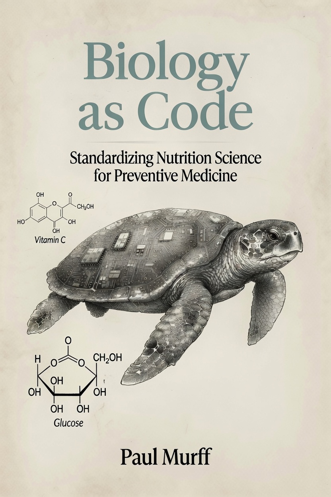

<h1 align="center">Biology as Code</h1>

<p align="center"><strong>Standardizing nutrition science for preventive medicine.</strong></p>

<p align="center">
  <a href="https://github.com/murffious/biology_as_code/actions/workflows/ci.yml"></a>
  <a href="https://github.com/murffious/biology_as_code/actions/workflows/docs.yml"></a>
  <a href="https://doi.org/10.5281/zenodo.21536449"></a>
  <a href="https://github.com/murffious/biology_as_code/blob/main/pyproject.toml"></a>
  <a href="https://github.com/murffious/biology_as_code/blob/main/LICENSE"></a>
  <a href="https://github.com/murffious/fdp-1"></a>
</p>

<p align="center">
  <a href="https://murffious.github.io/biology_as_code/"><strong>Documentation</strong></a> ·
  <a href="https://murffious.github.io/biology_as_code/cookbook/">Cookbook</a> ·
  <a href="https://murffious.github.io/biology_as_code/VALIDATION/">Validation report</a>
</p>

---

**`biology-as-code` models what happens to a meal — digestion, absorption, and the
metabolic pathways it drives — as inspectable, versioned, provenance-tracked code.**

Nutrition data loses its origins as it travels. A number measured once in one lab
becomes a label value, becomes a database entry, becomes an input to a score, and by
the end nobody can say what it was or how well it was evidenced. This package takes
the opposite stance: every value carries where it came from, missing data stays
missing instead of quietly becoming zero, and the rules are queryable data rather
than assumptions buried in code.

It is a zero-dependency Python package (3.11+) and it works on its own today.

> **Not medical advice.** Teaching and research software — not a clinical
> decision-support system.

> **On the name.** *Code Biology* (Barbieri and others) is an existing field that
> studies organic codes in living systems. This project is unrelated to it. The name
> here marks a methodological stance rather than a claim about semiotics: that
> nutrition and pathway models should be written like software — versioned, tested,
> provenance-tracked, fail-closed. That field is descriptive literature; this is a
> prescriptive tool. See [docs/naming.md](docs/naming.md).

## Announcements

Three working papers on federal nutrition data infrastructure are now published and
citable on Zenodo — [announcement thread](https://x.com/murffious/status/2085568972314071473):

| Date | Working paper | DOI |
|------|---------------|-----|
| 2026-08-07 | [Federal Nutrition Accountability and Processing Transparency Act](https://zenodo.org/records/21831722) | [10.5281/zenodo.21831722](https://doi.org/10.5281/zenodo.21831722) |
| 2026-08-07 | [Studies on Federal Nutrition Initiatives and Outcomes, 1900s–Present](https://zenodo.org/records/21830829) | [10.5281/zenodo.21830829](https://doi.org/10.5281/zenodo.21830829) |
| 2026-07-29 | [Systems Biology Over Reductionism: A Federal Blueprint for Nutrition Research Infrastructure, Open-Science Governance, and Matrix-Aware Regulation](https://zenodo.org/records/21658173) | [10.5281/zenodo.21658173](https://doi.org/10.5281/zenodo.21658173) |

These are policy and infrastructure companions to this repository: the papers argue the
case for provenance-tracked nutrition data, and this package is a working implementation
of it.

## Install

```bash
pip install biology-as-code
```

> **Note:** the first release is not on PyPI yet. Until it lands, install from source:
>
> ```bash
> git clone https://github.com/murffious/biology_as_code.git
> cd biology_as_code
> pip install -e ".[dev]"
> ```

## Quick start

```python
from biology_as_code import simulate_meal, list_pathways, pathway_activities, fed

result = simulate_meal(carbs_g=55, protein_g=35, fats_g=18, fiber_g=20)
print(result.absorbed_macros_g)
# {'carbs': 51.894, 'protein': 33.041, 'fats': 15.102}

print(list_pathways()[:5])
# ['glycolysis', 'tca_cycle', 'etc_oxphos', 'beta_oxidation', 'gluconeogenesis']

print(pathway_activities(fed())['glycolysis'])
# 0.868
```

Two runnable examples ship with the repo:

```bash
python examples/python/run_meal.py
python examples/python/fed_vs_fasted.py
```

Logging is quiet by default; `export BIOLOGY_AS_CODE_LOG=DEBUG` turns on digestion traces.

## What's inside

- **40 metabolic pathway graphs** — glycolysis, TCA, β-oxidation, ketogenesis and
  ketolysis, AMPK·mTORC1·SREBP nutrient sensing, and more. Fetch with `get_pathway(...)`,
  render with `visualization.pathway_to_mermaid`.
- **10 digestion machines** — the GI tract from oral to colon as versioned, inspectable
  state graphs: `list_machines()`, `trace()`, `run_digestion(...)`.
- **47 LAW-SPEC law cards** — the constitution as queryable data. `law_card("LAW-004")`
  returns its System, Organ, Gate, Bound, Conditions, and relation.
- **Meal simulation** — `simulate_meal(...)` plus fed, fasted, and exercise scenarios.
- **Bundled data** — meal fixtures, a vitamins registry, personas, and iron/colon/law data.
- **Provenance throughout** — `all_sources()` and `pubmed_url()` surface every citation.
  No fabricated data, and no network calls by default.

Not included: the patent-pending product/meal score (an open hook only), and the book text.

## Core ideas in 60 seconds

1. **Label ≠ dose** — printed milligrams are not delivered dose.
2. **Gate ≠ bound** — whether something can happen is a separate question from how much.
3. **Four seats** — host, partner, stage, clock, in one law envelope.
4. **L1→L5** — matrix → nutrient → mechanism → physiology → outcome, with no tunnels between levels.
5. **Empty beats fake** — missing data is `UNEVALUABLE`, never a green score.

The full reasoning is in the [constitution](docs/constitution.md).

## Built on FDP-1

This package is a reference implementation of
**[FDP-1: Food Data Provenance Declaration](https://github.com/murffious/fdp-1)** — a
minimal, RFC-style specification for declaring where a nutrient value came from and how
well a score built on it is validated. FDP-1 wraps any existing system (Nutri-Score,
Health Star Rating, Nutri-Grade, Food Compass, or a proprietary score) without modifying it.

- **Seven fields on a value, five on a score, one rule** — the *weakest-link rule*
  (§3.1): a score's provenance grade equals its lowest-graded input.
- **`OPEN` vs `NONE`** (§4) — *not known* versus *known-absent or not-applicable*. These
  are different claims and the spec keeps them apart.
- **`nutrient_ref`** resolves to the canonical CDNO food-composition vocabulary, with
  ChEBI, FDC, and INFOODS accepted as alternate keys. It does *not* resolve to
  [`MASTER_CROSSWALK.tsv`](MASTER_CROSSWALK.tsv), the nutrient→metabolite join this repo
  hosts as a separate downstream layer.

The specification, its reference validator, and the worked example live in the canonical
[`fdp-1`](https://github.com/murffious/fdp-1) repository, published as a citable Standard
on Zenodo: [**doi:10.5281/zenodo.21613721**](https://doi.org/10.5281/zenodo.21613721)
(concept DOI — always resolves to the latest version).

## Example food objects

Small teaching packets, each built to make one mechanism visible:

| File | Teaching point |
|------|----------------|
| [`spinach_salad_zero_fat.json`](examples/foods/spinach_salad_zero_fat.json) | Fat-vehicle gate **closed** |
| [`spinach_salad_with_oil.json`](examples/foods/spinach_salad_with_oil.json) | Same cargo, plus a lipid partner |
| [`lentils_with_tea.json`](examples/foods/lentils_with_tea.json) | Iron bound narrowed by tannin |
| [`lentils_with_ascorbate.json`](examples/foods/lentils_with_ascorbate.json) | Iron bound expanded by ascorbate |
| [`almond_whole.json`](examples/foods/almond_whole.json) / [`almond_flour.json`](examples/foods/almond_flour.json) | Matrix intact versus destroyed |

Files marked `status: stub` are placeholders awaiting real cargo and partner data — oats,
breads, rice, juice, salmon, dairy, tofu, UPF snacks, supplements, and more. See
[`examples/foods/`](examples/foods/) for the full set. To add one, copy
[`_template.json`](examples/foods/_template.json), keep the schema, and leave fields
`"open"` until you have real values. That last part is the whole point.

## Repository map

```text
docs/                      # public documentation site
schemas/                   # packet + claim + relation subset
examples/
  foods/                   # teaching food packets (gates / claims)
  claims/                  # claim audit fixtures
  units/                   # teaching UNIT fixtures
  python/                  # runnable scripts
src/biology_as_code/
  data/fixtures/meals/     # full meal JSON, ships in the wheel
  data/fixtures/           # vitamins, personas
  pathways/ dig/ simulation/ visualization/
```

Meals live in exactly one place (`src/biology_as_code/data/fixtures/meals/`). Foods are a
separate concept in `examples/foods/` — teaching packets, not meals.

## Documentation

- [Package architecture](docs/python/PACKAGE_ARCHITECTURE.md)
- [Add a pathway](docs/python/ADD_PATHWAY.md) — template, checklist, and integration check
- [GEM primer](docs/gem-primer.md) — genome-scale metabolic models, and how this differs
- [A note on the name](docs/naming.md) — why this is unrelated to Barbieri's *Code Biology*
- [Contributing](CONTRIBUTING.md) · [Roadmap](ROADMAP.md) · [Changelog](CHANGELOG.md)

## Related project

This repo models what a body *does* with a meal. The sensors and apps that measure the
body itself are the companion piece:
[**Awesome Internet of the Body**](https://github.com/murffious/awesome-internet-of-the-body)
is a curated, privacy-first list of open-source and standards-based apps, wearables, and
platforms for gathering human data — CGMs, wearables, FHIR, Open Humans, and others.

## The book

**Biology as Code — Standardizing Nutrition Science for Preventive Medicine** is
**in progress and not yet published.** There is nothing to buy or preorder yet, and the
manuscript is not in this repository; it will be released separately as a commercial book.

This repo is its open companion and is fully usable on its own. Issues are welcome for
schemas and examples — not for the book text.

## Status

Alpha. The Python package works today and installs from source; the schemas and food
objects will keep growing. Nothing here depends on the book being finished.

## License

- **Code:** [Apache-2.0](LICENSE), with a patent non-assertion covenant in [PATENTS.md](PATENTS.md).
- **Schemas and examples:** see [LICENSE-SAMPLES.md](LICENSE-SAMPLES.md) — permissive reuse with attribution.
- **Book text, figures, and brand:** © the author, all rights reserved unless separately licensed.

## Citation

If you use `biology-as-code` in your work, please cite the archived release:

> Murff, P. (2026). *Biology as Code: an open, provenance-tracked toolkit for meal
> digestion and metabolic-pathway modeling* (v0.1.0) [Software]. Zenodo.
> https://doi.org/10.5281/zenodo.21536449

A [`CITATION.cff`](CITATION.cff) is included, so GitHub's **Cite this repository** button
works as well.

---

<p align="center">
  
</p>

<p align="center"><sub>Cover art is a draft. The glucose chemistry shown on it is not yet corrected.</sub></p>
