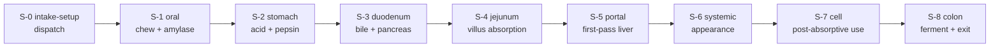

# Digestion process — the A-to-Z stage sequence

Where [the digestion **engine**](digestion.md) answers *"what does the body do with
this food?"*, this page is the **map it walks**: the full-digest process as a
versioned, inspectable sequence of nine stages, mouth to exit. Every stage is one
JSON state-graph you can open, diff, and trace — never hard-coded logic.

```python
from biology_as_code import run_digest_run, load_digest_run
from biology_as_code.carrier import SCHEMA_DIR

dr  = load_digest_run(SCHEMA_DIR / "fixtures" / "digest-run.example.json")
run = run_digest_run(dr)
[s["machine"] for s in run["stages"]]
# ['stage.intake-setup', 'stage.oral', 'stage.stomach', 'stage.duodenum',
#  'stage.jejunum', 'stage.portal', 'stage.systemic', 'stage.cell', 'stage.colon']
```

!!! note "Teaching model, not a digital twin"
    Stages carry **teaching averages** and **qualitative** edge cases, not
    kinetics. That is deliberate — see [Where this stops (on purpose)](#where-this-stops-on-purpose).

## The one distinction to internalize: S-0 vs S-1

The most common confusion is treating "the mouth" as the start. It isn't — there is
a step *before* the body acts at all. **`intake-setup` (S-0) is the dispatcher;
`oral` (S-1) is the first real digestion.** One decides *whether and what* you're
eating; the other is the body physically acting on it.

| | `stage.intake-setup` (S-0) | `stage.oral` (S-1) |
|---|---|---|
| **Question it answers** | "Is there a host, and what's on the tray?" | "What does the mouth *do* to it?" |
| **What happens** | host-ready gate → read presence flags (food / hydration / supplement `0\|1`) → fail-close if empty → **route** to food / capsule / liquid lane | cephalic cue → saliva → bite → **chewing (mastication)** → surface-area opening → **salivary amylase** → lingual lipase → bolus → swallow → epiglottis → peristalsis → LES → stomach |
| **Physiology?** | **None** — it's logistics / triage. No enzymes, no mechanics. | **Yes** — mechanical (chewing) *and* the first chemistry (amylase starts starch digestion) |
| **Analogy** | the maître d' seating you and reading your order | the kitchen actually starting to cook |

Chewing and salivary amylase live in **oral (S-1)**, which is where digestion
genuinely *begins*. `intake-setup` is the **pre-ingestion setup / dispatch** step:
identify the eater, confirm something is actually being eaten, pick the lane. (The
first true *pre-digestion physiology* — the cephalic phase, anticipatory salivation
and vagal gastric priming — is step 1 of oral (S-1), not S-0.) Splitting them is what
makes the journey a true A-to-Z — *deciding to eat* (S-0) is not the same event as
*the mouth working on it* (S-1).

## The full sequence



| Stage | id | What it models |
|------:|----|----------------|
| **S-0** | `stage.intake-setup` | Host-ready gate; read intake presence; fail-close empty; route the lane. *(pre-digestion)* |
| **S-1** | `stage.oral` | Cephalic cue → saliva → mastication → salivary amylase / lingual lipase → bolus → swallow → esophagus → LES. |
| **S-2** | `stage.stomach` | Acidification, pepsin, intrinsic factor, macronutrient-gated gastric emptying. |
| **S-3** | `stage.duodenum` | Bicarbonate neutralization, bile emulsification, pancreatic enzymes. |
| **S-4** | `stage.jejunum` | Villus/brush-border absorption and transporter gates. |
| **S-5** | `stage.portal` | First-pass hepatic partitioning. |
| **S-6** | `stage.systemic` | Peripheral appearance and clearance shape. |
| **S-7** | `stage.cell` | Post-absorptive cellular use (off-lumen). |
| **S-8** | `stage.colon` | Fermentation, SCFA, water reclamation, elimination. |

`process.full-digest` chains the stage ids only; the micro-steps live in each stage
file. Drill into any stage's `emits` (e.g. `stage:stage.oral`) to trace its graph.

### Inside a stage — the oral micro-sequence (S-1)

Each stage is itself a state graph. `oral` is the richest, and a good example of the
step-level detail available for teaching:

| Step | State | What happens |
|-----:|-------|--------------|
| 1 | cephalic cue | CNS anticipates intake before the first bite (weak when distracted / tube-fed). |
| 2 | saliva preload | Parotid/submandibular/sublingual output: water, mucins, electrolytes, enzymes. |
| 3 | incision / grab | Incisors and lips portion a controllable bite. |
| 4 | **mastication shear** | Molars grind; particle size is the first lever on later extraction. |
| 5 | matrix surface-area | Cell walls / emulsions fracture; downstream enzymes inherit this surface area. |
| 6 | **salivary amylase** | Starch → maltose begins while the bolus is still oral. |
| 7 | lingual lipase | Secreted here but acid-stable, so it acts mainly in the **stomach** (with gastric lipase); notable in neonates. |
| 8 | bolus formation | Tongue packs particles + saliva into a swallow-sized bolus. |
| 9–12 | swallow → LES | Voluntary swallow → epiglottis airway-protect → esophageal peristalsis → LES opens to the stomach. |

`oral` also carries **liquid** (skip-shear) and **capsule** (swallow-first) sublanes,
so hydration and supplements take physically honest paths, not the food path.

## One input both sides consume — the carrier

The process runs on a single **`DigestRun`** object — *who is eating* (host) + *what
is on the plate* (packet) + *how it enters the mouth* (ingestion). This is the same
JSON the product app validates; the Python engine loads it against the **same
schemas** (shipped under `machines/data/schemas/`) and flattens it with
`to_machine_context`, so the two can't disagree about what the input was.

```python
from biology_as_code import load_digest_run, to_machine_context, run_digest_run

dr  = load_digest_run("my_run.json")     # validated vs HostState / PacketLoad / IngestionEvent
ctx = to_machine_context(dr)             # flat dotted keys: host.* / meal.* / intake.*
run = run_digest_run(dr)                  # walk S-0 → S-8
```

Minimal shape:

```json
{
  "host":   { "ready": 1 },
  "packet": { "intake": { "food": 1, "hydration": 0, "supplement": 0 } }
}
```

A field the packet is silent about is left off the context (fail-closed) rather than
asserted as zero — except where the app supplies a documented teaching default, which
Python reproduces so both sides match. Prefer the four-seats ergonomics? A
`Conditions` view over any DigestRun is one call: `conditions_from_digest_run(dr)`.

## Why it's built this way

Three guardrails are structural, not stylistic:

- **Inspectable, not executable.** Every branch is a declarative predicate
  (`{field, op, value}`), so you can audit a stage without running code.
- **Versioned with drift detection.** Each machine has a `revision` cursor and a
  content `hash`; `validate_all()` fails CI on hash drift, dangling transitions, or a
  process chaining a stage that isn't registered.
- **Fail-closed and score-free.** Empty intake stops before the mouth
  (`UNEVALUABLE`, not a green default), and the validator rejects any score-shaped
  field — the open digestion layer carries **no** product-score / rubric hooks.

## Where this stops (on purpose)

These stages model the **causal structure** honestly. They carry only coarse
qualitative teaching-average time ranges (e.g. gastric emptying "~2–4 h") — **no
fitted kinetics, no rate constants, no "% starch hydrolyzed in the oral window."**
That is the project's *empty-beats-fake* stance: fabricating precise magnitudes would
break the credibility that makes this worth a student's time. Quantitative kinetics is
a **data-gated** roadmap item (Phase 2), additive to the existing states rather than a
rewrite — so you can build on this sequence today.

## Known refinements (cross the bridge later)

- **Kinetics (Phase 2, data-gated).** Attach absorption fractions and glycemic /
  insulin time-courses to stage outputs once reference datasets exist — never before.
- **Lane dedup.** `intake-setup.routePrimary` (S-0) and `oral.entryMode` (S-1) both
  branch on payload kind. `oral` re-derives the lane instead of trusting S-0's routing
  decision. It works (oral defaults sensibly), but a future pass could have oral
  consume S-0's decision. Low priority — do it only when touching that area.
