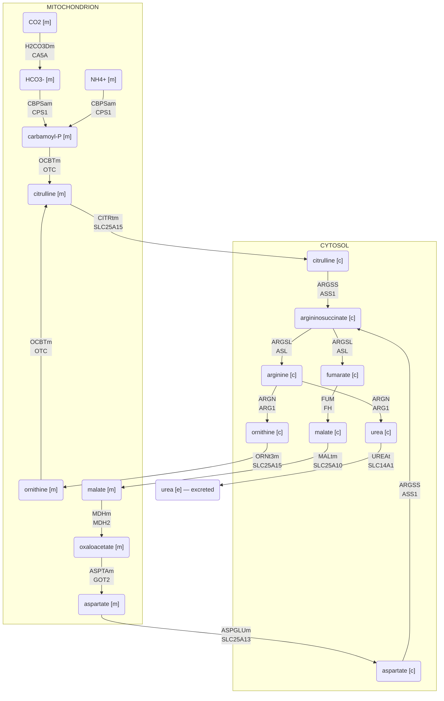

# Urea cycle — Recon3D reaction map

A **snapshot** generated from Recon3D 3.01: every reaction id, stoichiometry, EC
number and GPR below was read out of the model file, not drawn by hand.

> **The generator is not shipped in this package.** It lives in the surrounding
> monorepo at `tools/build_urea_cycle_figure.py`, because regenerating needs
> `scipy` plus the 2 MB `Recon3D_301.mat`, and Recon3D is **CC BY-NC** — it cannot
> be bundled into an Apache-2.0 package with zero runtime dependencies. Treat this
> page as a checked-in snapshot; re-run the generator in the monorepo to refresh it.

## Reactions

| Recon3D | Reaction | Gene(s) | EC | Subsystem |
|---|---|---|---|---|
| `H2CO3Dm` | `h2o[m] + co2[m] --> h[m] + hco3[m]` | **CA5A**, CA5B | 4.2.1.1 | Miscellaneous |
| `CBPSam` | `2 atp[m] + hco3[m] + nh4[m] --> 2 h[m] + 2 adp[m] + pi[m] + cbp[m]` | CPS1 | 6.3.4.16 | Glutamate metabolism |
| `OCBTm` | `orn[m] + cbp[m] --> h[m] + pi[m] + citr_L[m]` | OTC | 2.1.3.3 | Urea cycle |
| `CITRtm` | `citr_L[m] <=> citr_L[c]` | **SLC25A15**, SLC25A2 | — *see note* | Transport, mitochondrial |
| `ARGSS` | `atp[c] + asp_L[c] + citr_L[c] --> h[c] + amp[c] + ppi[c] + argsuc[c]` | ASS1 | — *see note* | Alanine and aspartate metabolism |
| `ARGSL` | `argsuc[c] <=> fum[c] + arg_L[c]` | ASL | 4.3.2.1 | Alanine and aspartate metabolism |
| `ARGN` | `h2o[c] + arg_L[c] --> orn[c] + urea[c]` | **ARG1**, ARG2 | 3.5.3.1 | Urea cycle |
| `UREAt` | `urea[e] <=> urea[c]` | **SLC14A1**, SLC14A2, SLC5A1, SLC5A5 | — *see note* | Transport, extracellular |
| `ORNt3m` | `h[c] + orn[m] <=> h[m] + orn[c]` | **SLC25A15**, SLC25A2 | — | Transport, mitochondrial |
| `FUM` | `h2o[c] + fum[c] <=> mal_L[c]` | FH | 4.2.1.2 | Citric acid cycle |
| `MALtm` | `pi[m] + mal_L[c] <=> pi[c] + mal_L[m]` | SLC25A10 | — | Transport, mitochondrial |
| `MDHm` | `nad[m] + mal_L[m] <=> h[m] + nadh[m] + oaa[m]` | MDH1, **MDH2** | 1.1.1.37 | Citric acid cycle |
| `ASPTAm` | `akg[m] + asp_L[m] <=> glu_L[m] + oaa[m]` | GOT2 | 2.6.1.1 | Alanine and aspartate metabolism |
| `ASPGLUm` | `h[c] + glu_L[c] + asp_L[m] --> h[m] + glu_L[m] + asp_L[c]` | SLC25A12, **SLC25A13** | — *see note* | Transport, mitochondrial |

Recon3D GPRs are isoform-permissive. Where more than one gene satisfies a
reaction, the isoform that actually carries it in this compartment is in
**bold** and is the one the diagram labels.

### EC annotations withheld

Recon3D carries an EC number for these, but it does not survive checking,
so it is not reproduced above.

- **`CITRtm`** — Transport reaction — EC not meaningful. Recon3D's 3.2.1.14 is chitinase.
- **`ARGSS`** — Recon3D says 3.5.3.1, which is arginase (copied from ARGN). Argininosuccinate synthase is EC 6.3.4.5.
- **`UREAt`** — Transport reaction — EC not meaningful.
- **`ASPGLUm`** — Transport reaction — EC not meaningful. Recon3D's 4.1.1.15 is glutamate decarboxylase.

## Inborn errors on this pathway

| Gene | Blocks | Disease (VMH) | OMIM | Organ |
|---|---|---|---|---|
| CPS1 | CBPSam | Carbamoyl Phosphate Synthetase I Deficiency | 237300 | Nervous system |
| OTC | OCBTm | Ornithine Transcarbamylase Deficiency | 311250 | Nervous system, liver, skin, hair |
| ASS1 | ARGSS | Type I Citrullinemia | 215700 | Nervous system |
| ASL | ARGSL | Argininosuccinic Aciduria | 207900 | Nervous system, liver, skin |
| ARG1 | ARGN | Arginase Deficiency | 207800 | Nervous system, RBC |
| SLC25A15 | CITRtm, ORNt3m | Ornithine Translocase Deficiency/HHH (Hyperornithinemia, Hyperammonemia, Homocitrullinuria) Syndrome | 238970 | Nervous system, liver |
| SLC25A13 | ASPGLUm | Type II Citrullinemia | 603471 | Nervous system, liver |

## Sources

- **Recon3D 3.01** — Brunk E, et al. *Nat Biotechnol.* 2018;36(3):272–281. doi:[10.1038/nbt.4072](https://doi.org/10.1038/nbt.4072)
- **VMH database** (disease store) — Noronha A, et al. *Nucleic Acids Res.* 2019;47(D1):D614–D624. doi:[10.1093/nar/gky992](https://doi.org/10.1093/nar/gky992)
- **Gene symbols** — NCBI Gene, resolved from the Entrez ids in Recon3D GPR rules.

Recon3D and the VMH data tables are **CC BY-NC 2.0**. This page reproduces
facts (ids, stoichiometry, EC numbers, gene–disease mappings), not VMH's
rendered pathway maps, which are not redistributed here.

### Reaction-level references (Recon3D `rxnReferences`)

- `H2CO3Dm` — [10677517](https://pubmed.ncbi.nlm.nih.gov/10677517/)
- `CBPSam` — [10347186](https://pubmed.ncbi.nlm.nih.gov/10347186/), [12853138](https://pubmed.ncbi.nlm.nih.gov/12853138/)
- `OCBTm` — [12538786](https://pubmed.ncbi.nlm.nih.gov/12538786/), [6372096](https://pubmed.ncbi.nlm.nih.gov/6372096/)
- `CITRtm` — [14598172](https://pubmed.ncbi.nlm.nih.gov/14598172/)
- `ARGSL` — [11747432](https://pubmed.ncbi.nlm.nih.gov/11747432/), [12408190](https://pubmed.ncbi.nlm.nih.gov/12408190/), [3463959](https://pubmed.ncbi.nlm.nih.gov/3463959/)
- `ARGN` — [1008818](https://pubmed.ncbi.nlm.nih.gov/1008818/)
- `UREAt` — [10893432](https://pubmed.ncbi.nlm.nih.gov/10893432/), [11024018](https://pubmed.ncbi.nlm.nih.gov/11024018/), [11034615](https://pubmed.ncbi.nlm.nih.gov/11034615/), [12679487](https://pubmed.ncbi.nlm.nih.gov/12679487/), [12748858](https://pubmed.ncbi.nlm.nih.gov/12748858/), [12856182](https://pubmed.ncbi.nlm.nih.gov/12856182/), [2490366](https://pubmed.ncbi.nlm.nih.gov/2490366/), [8063771](https://pubmed.ncbi.nlm.nih.gov/8063771/), [8559252](https://pubmed.ncbi.nlm.nih.gov/8559252/), [8806637](https://pubmed.ncbi.nlm.nih.gov/8806637/), [9341168](https://pubmed.ncbi.nlm.nih.gov/9341168/)
- `ORNt3m` — [14598172](https://pubmed.ncbi.nlm.nih.gov/14598172/)
- `MALtm` — [14598172](https://pubmed.ncbi.nlm.nih.gov/14598172/)
- `MDHm` — [15565635](https://pubmed.ncbi.nlm.nih.gov/15565635/), [9933076](https://pubmed.ncbi.nlm.nih.gov/9933076/)
- `ASPTAm` — [6930651](https://pubmed.ncbi.nlm.nih.gov/6930651/)
- `ASPGLUm` — [14598172](https://pubmed.ncbi.nlm.nih.gov/14598172/)

24 distinct PMIDs across 14 reactions.
