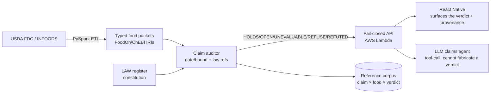

# Standardization Roadmap — owning food *judgment*
and a study record that fails on a real NIH trial in a way you can reproduce from a browser.

They aren't three peers, and that's the first thing worth saying.

One organisation, its standard, and an unrelated checklist
EuroFIR is an organisation — a Brussels AISBL. It doesn't compare to the other two; it made one of them. Working through CEN/TC 387 (launched 2008, led by the Swedish Standards Institute), it produced EN 16104:2012. It also maintains the value thesauri, LanguaL, FoodEXplorer and eBASIS.

STROBE-nut comes from a different community entirely — nutritional epidemiologists, Lachat et al. 2016 in PLoS Med. No relationship to either.

STROBE-nut	EN 16104:2012	EuroFIR
What it is	Reporting checklist, 24 items	Formal European Standard	The organisation
Governs	A paper about a study	A data file about foods	Compilers, thesauri, tooling
Layer	L5 Reporting (score 40)	L3/L4 (45/30)	L1–L4
Machine-checkable	No — prose	Yes — XML encoding, controlled vocabularies	Yes, via the above
Can reject	Nothing	An undocumented food value	An undocumented value
Enforced by	Journals that ask	Contracts, compiler culture	Membership
Access	Free	Paid CEN document	Membership + pay-per-view
They never touch
STROBE-nut asks whether you told the reader how diet was measured. EN 16104 governs whether a number in a table carries its component, value, method and reference.

A trial can satisfy both and still have no machine-readable study record, because neither is one. That's not a gap either of them failed to fill — it's outside both scopes. Which is exactly the space MI-Nutrition claims, and why the honest framing is neighbours, never competitors.

Note also: the only one of the three that can mechanically reject anything rejects a food value, not a study.

Two corrections to my own work from this
Four entities or five? EuroFIR's thesauri documentation says "The four main entities (Food, Component, Value, Reference) are mandatory." The standard summary says five, adding Method. The disputed entity is precisely the field this project argues hardest for. I've marked it unresolved in ch34 rather than picking one — and noted that if method is optional there, requiring it (or an explicit declaration of its absence) is a real divergence, not a restatement. Reading the CEN text settles it; it costs money.

I was wrong to flag trend: flat on STROBE-nut. Our register measures title-or-abstract presence in a 2.0M-article slice: 14 mentions. My Europe PMC pull measures full text across all of PMC: 374. A 27× gap, both honest.

adoption-trends.v1.json already says the careful thing: "a floor on use, not a measure of adoption: CONSORT, required by hundreds of journals, reaches 260 of those two million abstracts." Its trend runs on the rate — sparse: true, peak 0.31 per thousand, latest 0.20. Flat is correct. I've fixed STANDARDS-BY-LAYER.md so two of our own artifacts don't contradict each other.

That's the same trap as MIAME's falling curve, from the other side: a mention count is defined by its corpus and its field, and neither number is adoption.

What this settles for the pin
EN 16104 is the food-number neighbour of FDP-1 — arguably its predecessor, and the convergence is worth publishing as such. STROBE-nut is the prose neighbour of MI-Nutrition, already correctly filed as E05 in the tracker.

Neither goes in schema_ref. Catalog both, map fields with closeMatch, and don't let a checklist attached to a PDF count as conformance.

The difference: one names, the other constrains
STUDY.md is the pin — 36 lines, no fields. It says which contracts this study submits to, plus the three rules that aren't schemas (refusal, the split, Fort Lauderdale). It's a declaration of allegiance. It validates nothing itself.

MI-Nutrition is one of the three things it names — 17.9 KB, 18 fields, and a validator that computes conformance and refuses its own template.

Nearest analogy: STUDY.md is a dependency block; MI-Nutrition is a dependency. You could delete every field from the schema and STUDY.md would still parse — it would just be pointing at nothing. That's exactly why it lists three refs now: it was pointing at food and packet and behaving as if that covered studies.

What's actually novel — the schema answers this itself
Every MI-Nutrition field carries x-covered-by-strobe-nut. Four required fields are marked False — meaning nothing in STROBE-nut covers them:

#	Field	What it forces
1	intent.value_lane	prevention / risk_association / treatment — the lane that stops an association becoming advice
2	intent.study_value_hypothesis	what the study claims is worth knowing, stated
5	population_fence.fence_summary	who this does not apply to
12	food_composition.imputation	was any number borrowed rather than measured
That's the honest size of it: four fields, not eighteen. The other fourteen are STROBE-nut's topics rendered as typed slots.

And two of those four — value_lane and population_fence — are the only rows anywhere on our tracker mapped to L7 Translation/scope, nutrition's lowest score at 20. Nothing in CONSORT, SPIRIT, STROBE-nut, DID-METAB or EN 16104 operates there. That's consistent across every check this week, and it's the strongest claim available.

After the survey, here's the honest ledger
Not novel:

FDP-1's field list. EN 16104 got there in 2012 — same five entities. Convergence, and I'd publish it as convergence.
MI-Nutrition's coverage. Mostly STROBE-nut, retyped.
The nine-layer stack shape. That's an ordinary maturity model.
Novel, with evidence:

The four fields above, and their L7 occupancy.
Conformance computed, never asserted — the validator returns none (required 12/14) on our own template and names the missing fields. STROBE-nut is a PDF; nobody's PDF can fail.
ref_level, where the unit is the assignment (id × record × field), not the identifier. The same UBERON term is correct on one law and wrong on another. I haven't seen that modelled anywhere else.
Three-state absence — omitted / OPEN / NONE.
The declared↔observed join. Newest and least built, and the MiNT case proves it catches something no checklist can see.
The uncomfortable part: most of that list is unadopted, not unprecedented. Zero external users, and MI-Nutrition can't even be cloned yet — schema public, validator not.

What I'd actually claim
Novelty isn't the asset here, and the survey is what showed that. EN 16104 converged on the right decomposition in 2012 and changed little — because it was gated and sat in one layer.

What's distinctive isn't a field list. It's that the whole stack is public, executable, and refuses — a spec, a validator, negative fixtures, a gate that keeps people out of a food repo, and a study record that fails on a real NIH trial in a way you can reproduce from a browser.

EuroFIR had the better standard and a members-only corpus. We have a weaker standard and no members. The four fields are worth defending on the merits; the rest of the claim should be executable and open, not first.

> Strategic direction for *Biology as Code*. Written in advisor voice: where the
> leverage actually is, what to build in what order, and what to refuse. It sits
> above the engineering [Roadmap](https://github.com/murffious/biology_as_code/blob/main/ROADMAP.md)
> — that one says *how to ship the package*; this one says *what the package is for*.

## The thesis in one line

**Food identity is standardized. Food composition is standardized. Food *judgment*
is not.** Nobody versions, tests, or certifies the rule that turns a composition
into a verdict — and that is the empty slot this project can own.

| Layer | Standard exists? | Who owns it |
| --- | --- | --- |
| **Identity** — what is this food | Yes | FoodOn, LanguaL, ChEBI, NCBITaxon |
| **Composition** — what's in it | Yes | USDA FDC, INFOODS, EuroFIR |
| **Judgment** — what does it *mean* for a claim | **No** | **open — this is the wedge** |

The evidence the gap is real is the number now cited in the paper: five regional
nutrient-profiling models, run against the same 15,342 foods, disagreed on 5–37%
of classifications, and most had never been validated at all
([Poon et al. 2018, PMID 30015603](https://pubmed.ncbi.nlm.nih.gov/30015603/)).
Same input, different verdict, no spec, no test suite. That is not scientific
disagreement — it is absent specification.

## A short history — how the gap opened

Nutrition science has moved through three eras, and each solved the previous era's
crisis by standardizing a different thing. The judgment layer is the era we are in
now, and it is the first one that has *not* yet produced its standard.

- **Deficiency era (c. 1747–1940s).** Lind's citrus trial for scurvy, then the
  isolation of "vitamines" (Funk, 1912) and the discovery that single missing
  compounds cause defined diseases — beriberi, pellagra, rickets. Nutrition meant
  *preventing deficiency*. Its standard artifact was the **RDA** (first issued 1941):
  a floor, per nutrient.
- **Calorie & macronutrient era (mid-20th c.).** With deficiencies largely solved in
  wealthy nations, focus shifted to energy balance and macronutrients — the food
  pyramid, dietary guidelines, the calorie as the unit of account. Powerful and
  reductive: it standardized *composition* but flattened food to four or five numbers.
- **Chronic-disease era (late 20th c.–now).** Diet-related chronic disease — CVD,
  type 2 diabetes, NAFLD — overtook deficiency as the burden. Attention moved to
  dietary *patterns*, processing (the **NOVA** classification, Monteiro, c. 2009),
  bioactive compounds, and the microbiome. To act on this, dozens of **nutrient
  profiling models** appeared to rate foods — and here the standard failed to form:
  the models were built, deployed into regulation, and *never validated against each
  other* (Poon 2018, above).

Identity was standardized (FoodOn/LanguaL). Composition was standardized (FDC,
INFOODS). Judgment — the rule that turns composition into a verdict — is the era's
missing artifact. That is the opening.

## The current landscape — who is standing where

The three layers are at very different stages of standardization *right now*. This
is the map to build against.

- **Identity — actively, collaboratively standardized.** FoodOn transformed the
  LanguaL thesaurus into a machine-readable ontology
  ([Dooley et al. 2018, NPJ Sci Food; PMC6550238](https://pmc.ncbi.nlm.nih.gov/articles/PMC6550238/)),
  and the **Joint Food Ontology Workgroup**
  ([FoodOntology/joint-food-ontology-wg](https://github.com/FoodOntology/joint-food-ontology-wg))
  now coordinates FoodOn with FOBI, ONS, MAxO and ECTO under FAIR / MIREOT reuse
  principles. This is a live effort with curators and monthly cadence — **bind to it,
  do not rebuild it.**
- **Judgment — attempted, not standardized.** The most serious attempt at a spec is
  Drewnowski's manual for building globally-usable nutrient-profiling models
  ([Drewnowski et al. 2021, Adv Nutr; PMC8166553](https://pmc.ncbi.nlm.nih.gov/articles/PMC8166553/)).
  But it is guidance for *authoring* a model, and it shows models must legitimately
  diverge by context (a wealthy-nation "penalize empty calories" model is wrong for a
  micronutrient-deficient LMIC setting). It is not a conformance suite that *tests*
  models against a reference. There is still **no test corpus** — which is exactly the
  artifact this project should publish.
- **Regulation — moving this year.** The FDA's 2026 slate includes a redefined
  "healthy" claim (effective Feb 2025, enforced 2028) and a *proposed mandatory
  front-of-package box* rating saturated fat, sodium and added sugars as Low / Medium
  / High — still pending finalization
  ([IngrediCheck, FDA 2026 rules](https://www.ingredicheck.app/blog/whats-changing-on-food-labels-in-2026-fdas-new-rules)) —
  alongside spreading warning-label schemes in Chile and Mexico. An unvalidated
  scoring rule is about to ship to a continent's food supply.
- **Naming — a stake already planted.** "Code Biology" is Marcello Barbieri's
  *descriptive* paradigm — life as chemistry, information and meaning
  ([Barbieri 2025, Biosystems 248:105400; PMID 39826706](https://pubmed.ncbi.nlm.nih.gov/39826706/)).
  This project is *prescriptive*: write nutrition science **as** code, versioned and
  testable. The repo already draws that line in [naming.md](naming.md); keep it in
  anything public so the two are a contrast, not a collision.

## Why "dietary health claims expert" is the correct goal

Being the world expert in dietary health claims is not a pivot away from this
codebase — **the claim auditor already merged into this repo is a claims-adjudication
engine.** It takes a food packet and a claim, walks the mechanism through a
law-backed gate/bound table, and returns one of five honest verdicts —
`HOLDS`, `OPEN`, `UNEVALUABLE`, `REFUSE`, `REFUTED` — every one carrying its law
citations and never inventing a magnitude it cannot source. That is the assay.

The authority does not come from having opinions about food. It comes from owning
**the harness other people's claims get run through** — the way Unicode owns the
conformance suite, not every string. The path to "world expert" is therefore not
louder claims; it is:

1. a **declared, versioned rule table** (built: `audit/gates.py`, cannot drift from
   the constitution without turning CI red);
2. a **published reference corpus** of claim × food × expected verdict (the missing
   artifact — see below);
3. a **provenance trail** on every verdict (built: law refs, derivation markers,
   the [validation ledger](VALIDATION_LEDGER.md));
4. a **fail-closed default** so the system is never caught asserting what it cannot
   defend (built: `UNEVALUABLE`/`REFUTED`, "empty beats fake").

Three of those four exist today. The corpus is the one deliberate build.

## The standardization blueprint, mapped to own-vs-partner

The field is standardizing across three layers. Be honest about which this project
*owns*, which it *consumes*, and which it *partners* on — trying to build all three
is how a focused engine becomes an unshippable platform.

| Layer | Blueprint elements | This project should… |
| --- | --- | --- |
| **Data** | food ontologies, biomarker tracking, NOVA/UPF metrics | **Consume** — bind inputs to FoodOn/ChEBI IRIs; do not rebuild FDC. |
| **Research** | controlled baselines, N-of-1, pre-registration, open data | **Partner** — the auditor is the reproducible scoring layer trials plug into; it is not a trial platform. |
| **Judgment** | the rule that turns composition into a verdict | **Own.** This is the only layer with no incumbent. Everything else is in service of it. |

The trap in the pasted blueprint is that CGM, metabolomics, computer-vision food
logging, and wearable fusion are all **Data-layer** bets with deep-pocketed
incumbents and clinical-partnership dependencies. They are not your wedge. Your
wedge is the one column nobody else is standing in.

## Your stack → the build-out (Path A leads)

Full-stack engineering, PySpark, serverless AWS, React Native. That maps cleanly
onto the Judgment layer without needing a lab.

- **PySpark + AWS data lake — fill the packet backlog.** The auditor is only as
  useful as the packets it can read; most still return `UNEVALUABLE` for lack of
  declared fields. A pipeline that ingests FDC/INFOODS and emits typed packets
  (structural fields only, magnitudes left `open` unless sourced) turns the backlog
  into throughput. **This is the highest-leverage first build** — it multiplies the
  value of everything already merged. Discipline: the pipeline declares structure,
  never invents magnitudes; `scripts/fill_packets.py` is the pattern to scale.
- **Serverless API — the auditor as a service.** Wrap `audit_claim` behind a
  stateless Lambda. Zero-dependency pure Python is already Lambda-native (no layer
  wrangling). Every response ships the verdict, the law refs, and the provenance —
  the fail-closed contract travels over the wire.
- **React Native — surface honesty, not a score.** The differentiator is a UI that
  shows `UNEVALUABLE`/`REFUTED` as first-class results ("grey, not a fake zero"),
  with the law citations one tap away. Glassmorphic polish reduces tracking
  friction; the *content* discipline is what no competitor ships.
- **The graph/biochemical-scoring idea, grounded.** The LAW register already *is* a
  graph of nutrient → gate/bound → outcome relations. You do not need a new graph DB
  to start; you need the existing table to grow and stay CI-guarded. Graph storage
  is a scale-out concern for when the register is large, not a day-one rewrite.

## The one deliberate build: a reference claims corpus

This is the artifact that makes you the authority. Nutrient profiling has no
conformance suite; Unicode and HTML do.

- **Shape:** N foods with FDC IDs × a set of health claims × the expected verdict
  and the law path that produces it. Published as **normative**, not internal.
- **Grounded in the WHO validation ladder** (already echoed in
  [VALIDATION.md](VALIDATION.md)): content validity → unit tests, convergent
  validity → regression against a reference model, predictive validity → production
  validation. Publish the project's tier honestly rather than asserting authority.
- **Why it wins:** once a corpus exists, any scoring model — including the
  incumbents that disagreed 5–37% of the time — can be *run through your harness*
  and scored for conformance. You stop being a competing score and become the test
  the scores are measured against.

## The LLM claims agent, done fail-closed

The natural application of the claims agent is **tool-calling the auditor**, not
replacing it. The LLM proposes a structured claim; the deterministic auditor
returns the verdict with citations. The model can phrase and explain, but it
**cannot fabricate a verdict** — the gate table and `REFUSE`/`UNEVALUABLE`/`REFUTED`
defaults make the failure mode "declines to answer," never "confidently wrong."
That is the exact property regulators and clinicians need and cannot get from a
black-box nutrition chatbot. Build the agent as a thin client over the API above.

## Sequencing — honest tiers

| Horizon | Build | Depends on | Owns the wedge? |
| --- | --- | --- | --- |
| **Now (weeks)** | PySpark→packet pipeline; auditor API on Lambda; publish the claims corpus v0 | merged auditor | Yes — directly |
| **Mid (months)** | grow the LAW register + gate/bound coverage; React Native app that surfaces verdicts + provenance; LLM claims-agent tool-call | corpus + API | Yes |
| **Horizon (needs partners)** | convergent-validity study vs incumbent models; predictive validity against cohort data; N-of-1 / CGM tie-ins | clinical & data partners | Extends the wedge; do not lead with it |

Do not invert this. The horizon tier is where the pasted blueprint's most exciting
words live (CGM, metabolomics, N-of-1) — and it is exactly the tier you cannot
execute solo, so it must not be the first thing built.

## Guardrails that must survive scale

Growth is where fail-closed systems quietly become fail-open. These are load-bearing:

- **Empty beats fake.** A missing field is `UNEVALUABLE`, never a default pass. The
  packet pipeline must preserve this even at millions of rows.
- **Gate ≠ Bound.** Categorical absence (no path) is not a magnitude effect. The CI
  invariant (`GateRule` ↔ `gate.present == True`) exists to stop this drifting.
- **No magnitude without primary evidence.** The LAW-026 energy band stays a soft,
  unlocked prior until a human ME study is read (PMID 40403748). The policy tests
  fail anyone who "finishes" it early. Apply the same rule to every new law.
- **`REFUTED` is a real verdict.** Evaluated-and-false is distinct from
  declined-to-evaluate. Never collapse them to make output look more decisive.
- **The [validation ledger](VALIDATION_LEDGER.md) is the mechanism.** Every domain
  claim carries a source and a strength score; new claims join it before they ship.

## The regulatory hook

The FDA front-of-package box and the Chile/Mexico warning labels (see *The current
landscape* above) are all unvalidated scoring rules shipping to entire national food
supplies on multi-year deploy cycles. That is the cold open. Position accordingly:
*Biology as Code* is not another score in that fight — it is the versioned,
provenance-tracked, fail-closed **harness the contested scores get run through.**

## What not to build

- A calorie counter, a macro tracker, or a general nutrition chatbot — solved,
  crowded, and off-wedge.
- A food-composition database — consume FDC/INFOODS, do not rebuild them.
- Runtime dependencies — zero-dep at runtime is a hard invariant; it is what makes
  the auditor auditable and Lambda-native.
- Any magnitude or verdict the corpus and law register cannot defend. The moment the
  system asserts what it cannot source, the entire "harness, not a score" position
  collapses.
