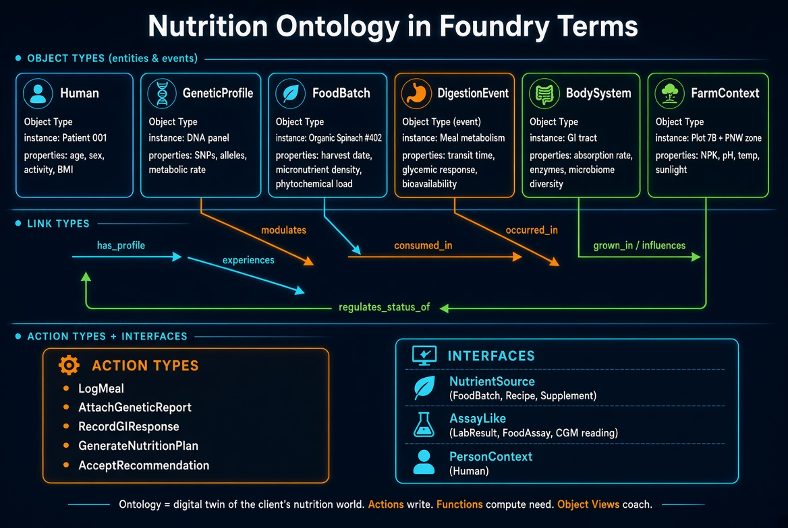
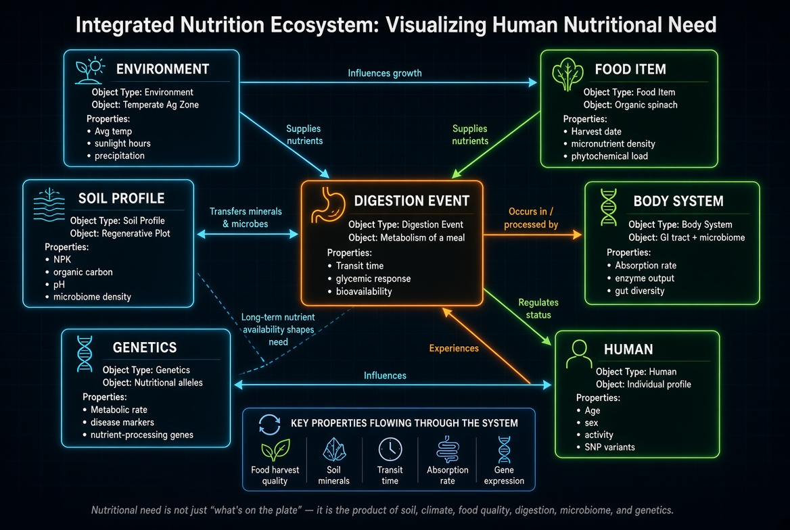
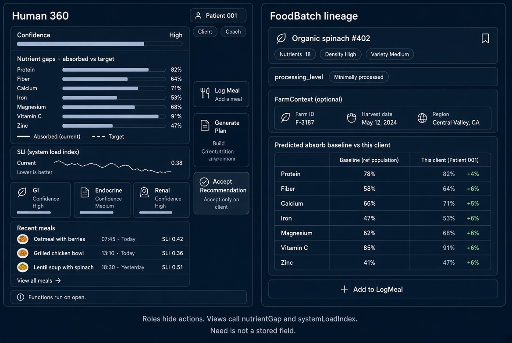

> **Raw conversation output — not reviewed, not normative.** Pasted 2026-08-29 as the working
> notes behind `body_system_protocol.py`, `shared_properties.md` and `roles_and_object_views.md`;
> where it disagrees with those files or with FDP-1, they win (this is Tier E in
> nutri-collective's rigor tiers: never cite directly). The SLI weights quoted below are the
> illustrative placeholder the README describes, not a fitted or product value. The image links
> point at screenshots kept in this folder. The spec it names is `../docs/nutrition_ontology_spec.md`;
> this folder's `nutrition_ontology_spec.md` is an earlier, shorter draft of it, and the revision
> that actually makes BodySystem an interface with the three implementers described below has
> not yet been merged into either copy.

`BodySystem` is the interface. Digestive, endocrine, and renal are the models. Need and System Load Index both call those models; they do not live as stored properties.


### Contract

Every system implements the same three methods:

| Method | Job |
|---|---|
| `absorb(incoming, meal)` | Transform the nutrient vector |
| `target_adjust(base_dri, human)` | Move the target |
| `load(event, incoming)` | How hard this meal hit the system |

GI changes **what arrives**. Endocrine changes **targets and disposal**. Renal changes **what is kept**. Order is fixed: gut → setpoint → kidney.

Kill the old `absorption_rate` float. That property was doing all three jobs badly.

### What each model owns

**DigestiveAssimilation** — LANGE-style stages: matrix access → hydrolysis → mucosal uptake. UPF/`processing_level` hits load here (collapsed matrix, enzyme demand), not a NOVA moral score.

**EndocrineSetpoint** — insulin sensitivity, metabolic rate, D status. Mainly `target_adjust`. Its `absorb()` only scales disposal of available carb so you do not double-count gut absorption.

**RenalHandling** — identity pass until eGFR exists. When it does: cap protein/K/P rather than silently raising DRI, and treat 1α-hydroxylation as conversion, not “eat more D.”

Hepatic and immune stay off the object list until you have rows. Microbiome stays a **GI property** until you have stool data.

### Two functions, two questions

| Function | Question |
|---|---|
| `nutrientGap` | Did they get enough X? |
| `systemLoadIndex` | How hard did the body work to get / clear it? |

A shake can close a protein gap and still raise renal + endocrine load. That split is the metric.

Weights for SLI are a published knob: gi 0.45, endocrine 0.30, renal 0.25. Change them in one place.

Files:


`../docs/nutrition_ontology_spec.md` now treats BodySystem as an interface with those three implementers.


Minimum to code: GI with three coefficients (matrix, hydrolyze, uptake), endocrine `target_adjust` for energy/D/iron, renal as pass-through, SLI averaging whatever is present. Same rule as the ontology — no object without rows.

see body.jpg

Yes for the **modeling core**. No for the **platform surface** (roles, views as apps, scenarios, search). Here is the concept-by-concept audit against that page.

| Foundry concept | Applied? | Where in our twin |
|---|---|---|
| Ontology as digital twin (datasets + models → one world) | **Yes** | Person’s nutrition world: food, meals, labs, systems, plan |
| Object type / object / object set | **Yes** | Types defined; an object = Patient 001, batch #402, one lunch. Object *sets* are implied (a human’s meals), not named as a type |
| Property / property value | **Yes** | Keys + required/optional props on each type |
| Shared property | **Yes** | `as_of`, `source`, `confidence`, and the `{nutrient_id, amount, unit}` vector |
| Link type / link | **Yes** | `has_profile`, `logged`, `consumed_in`, `has_system`, `occurred_in`, … |
| Action type + side effects | **Yes** | `LogMeal`, `IngestLabResult`, `GenerateNutritionPlan`, `AcceptRecommendation` write objects/links and then run functions |
| Functions (read objects, used by actions/apps) | **Yes** | `predictAbsorption`, `nutrientGap`, `rankNutrientSources`, `systemLoadIndex` |
| Interfaces (shared shape + capabilities) | **Yes** | `NutrientSource`, `AssayLike`, `PersonContext`, `BodySystem` (`absorb` / `target_adjust` / `load`) |
| Object Views | **Specified, not built** | Human 360, FoodBatch lineage, DigestionEvent replay — design only |
| Roles / permissioning | **No** | Called out as later (client vs coach vs lab). Not designed |
| Models mapped into the Ontology | **Yes** | DigestiveAssimilation, EndocrineSetpoint, RenalHandling *are* the models; functions are the call path |
| Derived properties | **Partial** | Gap and SLI are derived, but we refused to persist them as properties — that is the right anti-pattern dodge |
| Scenarios (what-if, then merge) | **No** | Would be “what if this week’s plan” — not modeled |
| Semantic search / OAG | **No** | Useful later for food matching; not core |
| Ontology-aware apps (Explorer, Manager, Rules, Map…) | **No** | We have a spec + Python protocol, not Foundry apps |

So the sentence from that page is covered:

> object types, properties, link types, and action types

plus the two concepts that page lists next: **functions** and **interfaces**.

Still missing from *that same page*: **roles** and real **Object Views**. Missing from the rest of the nav you pasted, on purpose: scenarios, semantic search, rules, monitors, materializations.

That is the correct split. Applying roles/scenarios/search now would be platform ceremony before you have rows.

**What “applied” means in practice**

- A meal is an **event object**, not a column on Human.  
- Need is a **function**, not an object.  
- Body systems share an **interface**, not one sparse type.  
- Writes go through **actions** with side effects, not silent UPDATEs.  
- GI / endocrine / renal are **models bound to the ontology**, which is what “Models in the Ontology” is for.

Not applied, and should stay that way until a second actor writes into the twin: roles, Object View apps, scenarios.

If you want the last two core concepts closed: a one-page **roles matrix** (client / coach / public food data) and a wireframe list of widgets per Object View. That would finish the documentation page. Everything after that is Foundry product, not the concept set.

Roles close who can write. Views close where they work. Both are specified; neither requires Foundry to ship.

### Roles (short form)

| | Client | Coach | Lab | Catalog | Public |
|---|---|---|---|---|---|
| Own meals / genes / labs | read + log | read assigned | write labs only | — | — |
| Food catalog | read | read | — | write | read published |
| Generate plan | draft self | assigned | — | — | — |
| **Accept plan** | **self only** | no | — | — | — |

Coach can offer. Only the person accepts. Catalog people never see a MealLog. Public never calls `nutrientGap(human_id)`.

### Views

MVP is two hubs. The rest wait for objects to exist.

**Human 360** — header + confidence strip · 7-day gap (absorbed vs target) · SLI sparkline · system cards · last meals · labs · action rail filtered by role  

**FoodBatch lineage** — nutrients + processing_level · farm if linked · predicted absorb on a baseline gut vs this client’s gut · “add to LogMeal”

Later: **DigestionEvent replay** (plate → GI → endocrine → renal → next lab), **NutritionPlan desk**, **BodySystem card**.

Widget rule: gap and SLI are computed when the view opens. Empty systems render as “not calibrated,” not as zero.

A shared property is reused metadata, not reused values. I’ll pin that down, then list the exact shared fields this twin should register once.

Full matrices and widget rules:



That finishes the core-concepts page: object types, properties, links, actions, functions, interfaces, **roles**, **object views**. What remains on Palantir’s nav (scenarios, semantic search, Rules, Manager) is platform, not the twin.
A **shared property** is one field definition reused across object types. The *metadata* is shared. The *values* are not.

Foundry’s own example: `Employee.start_date` and `Contractor.start_date` share name, description, base type (`date`), formatting, and search hints. Each object still has its own date. Same rule here: `MealLog.as_of` and `LabResult.as_of` are the same kind of timestamp. They are not the same instant.

This is not a **shared ontology** (multi-org space). Different concept, same word.

### What gets centralized

Name, description, RID, base type, value formatting, type classes, render hints, visibility. Change `unit`’s allowed list once; every type picks it up. Attach the shared property to a type without renaming that type’s API field — `drawn_at` can still *use* shared `as_of`.

### What this twin should register once

| Shared property | Base type | Why it must be shared |
|---|---|---|
| `as_of` | timestamp | “when this was true,” not “when we wrote it” |
| `source` | string enum | user / lab / usda / model / farm |
| `confidence` | double 0–1 | one scale, or SLI and gap become incomparable |
| `nutrient_id` | string vocab | food, lab, and plan must join |
| `amount` | double | never “12 mg” in one field |
| `unit` | UCUM string | `mg` ≠ `ug` ≠ `IU` |
| `human_id` | string | every PHI event points at the same person |
| `processing_level` | enum | GI.load reads this off food, not a parallel column |

Do **not** share `status` just because plans and labs both have a status. Same English word, different meaning.

Do **not** invent `protein_mg` as a shared property. Share `nutrient_id` + `amount` + `unit`, then put them in the vector. That is how you avoid 40 micronutrient columns.

### Shared property vs interface

- **Interface** (`NutrientSource`, `AssayLike`, `BodySystem`): this type *has this shape and these methods*.
- **Shared property** (`amount`, `unit`): those columns *mean the same thing*.

Without shared properties, Recipe will grow `qty` and FoodBatch will keep `amount`, and `rankNutrientSources` will need adapters forever.

Full catalog and the share / don’t-share list:

Yes — this is a security question. Split the data by how dangerous a leak is, then lock **who can run the function**, not just who can open a table.

Need is the awkward one: we never store “your needs” as a row. Anyone who can read your meals + labs + genes can *compute* them. So the permission is on those inputs, plus on `nutrientGap(human_id)`.

### Sensitivity ladder

| Data | What it is | Who may see it |
|---|---|---|
| Food catalog, farm NPK, USDA vectors | not you | anyone, including `public_reader` |
| MealLog, DigestionEvent | what you ate / how it sat | **you** + assigned **coach** |
| LabResult, BodySystem (GI / endocrine / renal) | your body | **you** + assigned **coach** (lab may *write* a result, not browse the rest) |
| GeneticProfile | your genes | **you** only by default. Coach only if you attach the report *and* grant it |
| `nutrientGap` / `systemLoadIndex` | computed need + load | same people who can read the inputs above |
| Other people’s genes / bodies / need | — | nobody. Not coaches of other clients. Not catalog. Not public. |

Lab writer can submit `IngestLabResult` for a consented `human_id`. They do not get a Human 360. Catalog editor never sees a meal or a SNP.

### Genes

Treat `GeneticProfile` as the tightest object in the twin.

- Default: client read, nobody else.
- Coach read is a **separate grant**, not implied by “I hired a coach.”
- Action `AttachGeneticReport` is the consent event. Until that action runs, there is no gene object to leak.
- Pipeline / public / catalog: no.
- Never put raw SNP files on Human 360. Allele *chips that already change a target* only, and only after grant.

If a coach can generate a plan without genes, they should. Missing genes lower confidence; they do not unlock the file.

### Body

`DigestiveAssimilation`, `EndocrineSetpoint`, `RenalHandling` are health records, not food data.

- You and assigned coach: read.
- Coach write only through `RecalibrateSystem` (audit it).
- Labs update a system only when the analyte maps to that system (eGFR → renal). That is a side effect of `IngestLabResult`, not open edit.
- Public never sees eGFR, insulin sensitivity, or enzyme output.

### Need

There is no `NutritionalNeed` object to ACL. Need is:

```text
nutrientGap(human) = target(human, genes?, systems?) − absorbed(meals, systems?)
```

So:

| If they cannot read… | they cannot see |
|---|---|
| your MealLogs | your intake / absorbed |
| your BodySystem | how your gut/kidney changed absorbed or targets |
| your GeneticProfile | allele-adjusted targets |
| the function itself | the gap chart on Human 360 |

Hide the widget if the role cannot call the function. Do not compute it and then “not show the number.”

Same for SLI.

### One-screen rule

```text
public     → food only
lab        → write assays, no tour of the person
catalog    → food / farm only
coach      → assigned body + meals + labs; genes only if granted
you        → all of yours; only you AcceptRecommendation
nobody     → anyone else’s genes, body, or need
```

That is the whole security model. The ontology already has the hooks (`client`, `coach`, `lab_writer`, `catalog_editor`, `public_reader`). Genes are just the row you lock hardest; need is the function you refuse to run without those rows.